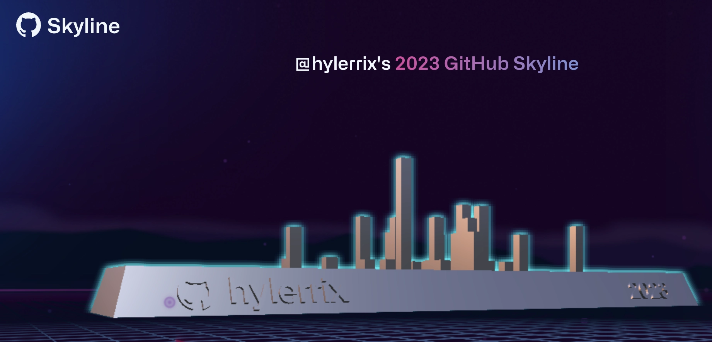
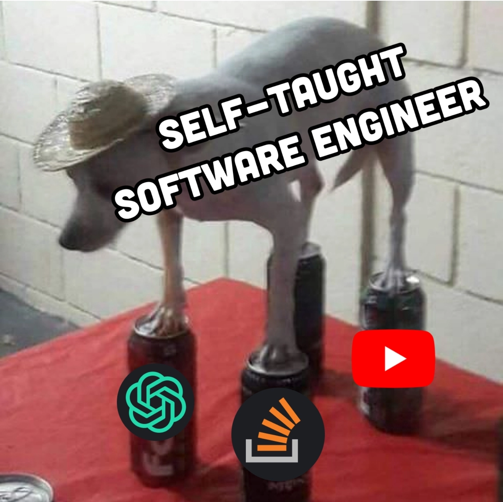
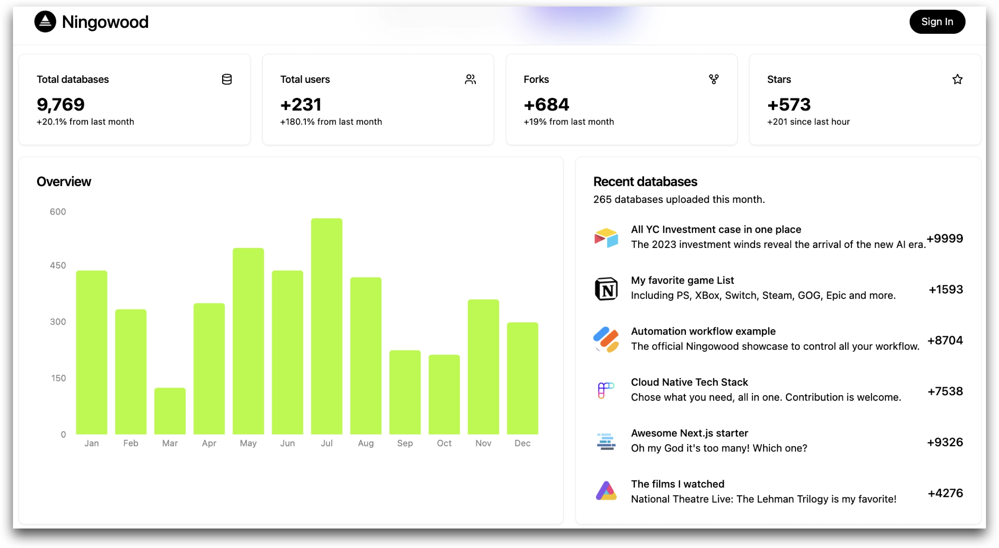
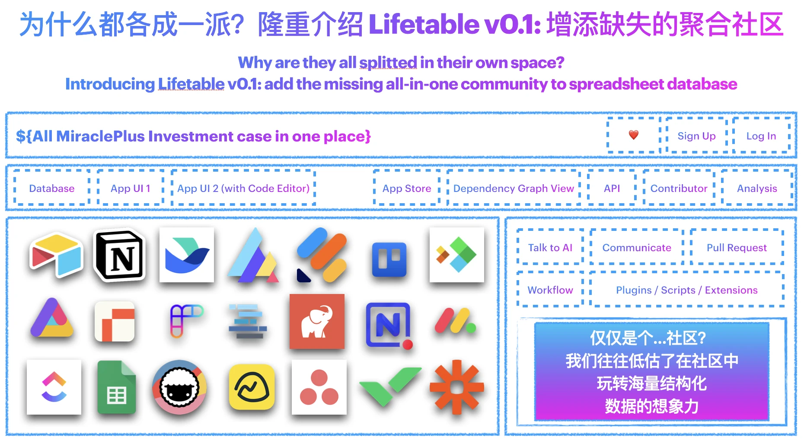
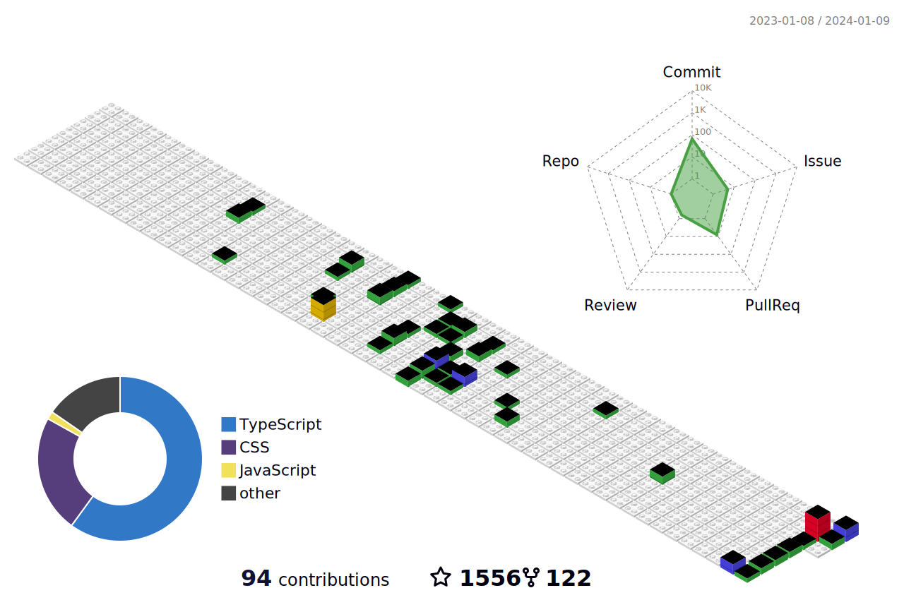

<h1>:merman: Hi!</h1>

<h2>:merman: About Me </h2>

> [你好，我是凝尘 (Hylerrix)](http://lifetable.feishu.cn/wiki/TPCdwDi44iCXojkazI4clA5Onyg)

In Open Source community, 2024, I'm mainly focusing on building the next generation all-in-one database sharing community [Lifetable.ai](http://lifetable.ai) now (See above line for more in Chinese introduce), proudly using `React v18`, `Next.js v14` and more.

Thanks for clicking 'Follow' to knowing the next step!

<table cellspacing="0" cellpadding="0" style="border: none;">
  <tr>
    <td>
      <!-- <a href=""> -->
      
      <!-- </a> -->
    </td>
    <td>
      <!-- <a> -->
      
      <!-- </a> -->
    </td>
  </tr>
</table>

<h2>:sunrise: Let's build <a src="http://lifetable.ai" target="__blank">Lifetable.ai</a> for 2024!</h2>

> [欢迎来到 Lifetable.ai 凝搭社区！](http://lifetable.feishu.cn/wiki/DTNKwjQQJiVuv6kDd5jc5W0Xnjh)

<table>
  <tbody>
    <tr>
      <td style="width: 50%;"></td>
      <td style="width: 50%;"></td>
    </tr>
  </tbody>
</table>

<!--START_SECTION:activity-->

<!-- `[12/23 08:42]`  Starred [AnarchyLinux/installer](https://github.com/AnarchyLinux/installer) 

Show More

`[12/20 18:13]`  Commented on [`#9`](https://github.com//cheesits456/discord-ssh-bot/issues/9 'Can´t read property') in [cheesits456/discord-ssh-bot](https://github.com/cheesits456/discord-ssh-bot)

 -->

<!--END_SECTION:activity-->

<h2>:heart: Statistics for my Open-Source-Love</h2>

<table cellspacing="0" cellpadding="0" style="border: none;">
  <tr>
    <td>
      
    </td>
    <td>
      
    </td>
  </tr>
</table>

<!-- <h2>:robot: My latest posts</h2>

Need to think the center writing platform and make a robot for this.

<ul>
  <li><a href="https://medium.com/better-programming/how-you-should-structure-your-react-applications-e7dd32375a98"><b> How You Should Structure Your React Applications</b></a> <i>A matter of taste, sure, but here is an approach that scales.</i></li>
</ul> -->

<!--START_SECTION:top-followers-->

<!--END_SECTION:top-followers-->
