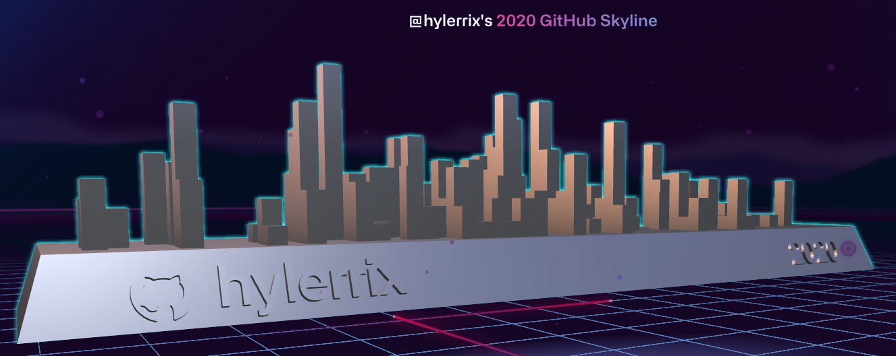
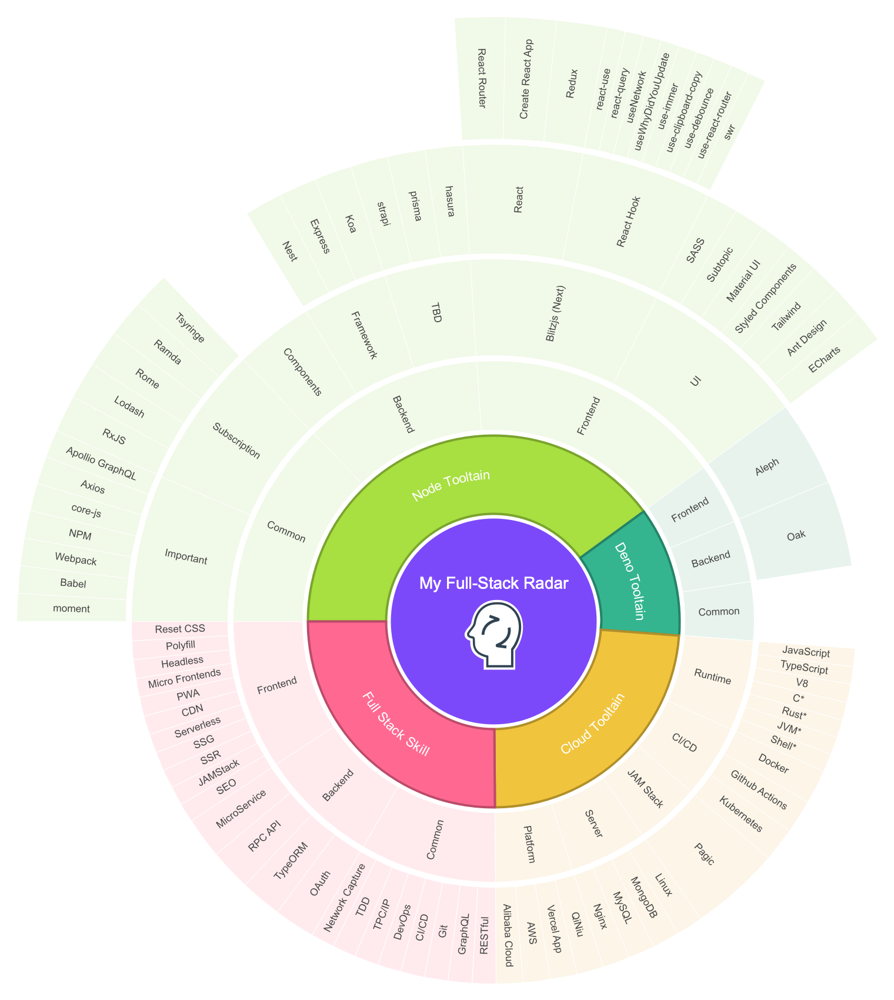

<h1>:merman: Hi, nice to meet you in 2021!</h1>

<h2>:heart: This is a Hunger Game</h2>

<!-- https://getpocket.com/@hylerrix -->

TL;DR. I'm mainly focuing on `React v17`, `Deno v1` and `TypeScript v4`, also have a great intresting in `Nest v7`, `Material v5`, `Apollo GraphQL` and `Rust`...

Is that enough for me to know the entire surface about the Big FrontEnd? Nooooo, not at all. I must learn more popular open-source REPO's philosophy and make plenty of exercises to catch the cutting-edge development of the Web. But also, remember to choose a main REPO to make deeper research and contribution in mind.

<!-- 
  * design tooltain
    * architecture: drawio
    * mind mapping: MindMaster
  * processon ----
  * xmind
  * mobile: Apple Style Guide, iOS HIG, Android Design, material design, desktop ui design
  * material ui? pinterest YuQue! Ant Design! Echarts, hasura
  * Google Drive
-->

<!-- 
https://github.com/anuraghazra/github-readme-stats
https://github.com/matchai/awesome-pinned-gists
https://github.com/matchai/waka-box
https://github.com/dwyl/hits
https://hitsofcode.com/generate
https://github.com/athul/waka-readme
https://github.com/abhisheknaiidu/awesome-github-profile-readme

Example:

https://github.com/Gapur
 -->

<!--

-->

<table cellspacing="0" cellpadding="0" style="border: none;">
  <tr>
    <td>
      
      
      
      
      
    </td>
  </tr>
  <tr>
    <td>
      
      
      
      
      
    </td>
  </tr>
  <tr>
    <td>
      
      
      
      
      
      
    </td>
  </tr>
  <tr>
    <td>
      
      
      
      
      
    </td>
  </tr>
  <tr>
    <td>
      
      
      
      
      
      
    </td>
  </tr>
  <tr>
    <td>
      
      
      
      
      
      
      
      
      
    </td>
  </tr>
  <tr>
    <td>
      
      
      
      
      
      
      
    </td>
  </tr>
  <tr>
    <td>
      <a href="">
      
      
      
      
      
      
      
      
      
      
      
    </td>
  </tr>
  <tr>
    <td>
      
      
      
      
      
      
      
      
      
      
    </td>
  </tr>
  <tr>
    <td>
      
    </td>
  </tr>
</table>

<!-- <h2>:sunrise: Application Project</h2> -->

<h2>:sunrise: Ebook & Practice Project</h2>

<table cellspacing="0" cellpadding="0" style="border: none;">
  <thead align="center">
    <tr border: none;>
      <td><b>🎁 Projects</b></td>
      <td><b>⭐ Stars</b></td>
      <td><b>📚 Forks</b></td>
      <td><b>🛎 Issues</b></td>
      <td><b>📬 Pull requests</b></td>
      <td><b>ℹ️ Infos</b></td>
    </tr>
  </thead>
  <tbody>
    <tr>
      <td><a href="https://github.com/hylerrix/deno-tutorial"><b>Deno Tutorial - Chinese</b></a></td>
      <td></td>
      <td></td>
      <td></td>
      <td></td>
      <td></td>
    </tr>
    <tr>
      <td><a href="https://github.com/hylerrix/es-interview"><b>ECMAScript+ Interview - Chinese</b></a></td>
      <td></td>
      <td></td>
      <td></td>
      <td></td>
      <td></td>
    </tr>
    <tr>
      <td><a href="https://github.com/hylerrix/deno-algorithm"><b>Deno Algorithm</b></a></td>
      <td></td>
      <td></td>
      <td></td>
      <td></td>
      <td></td>
    </tr>
  </tbody>
</table>

<h2>:robot: Recent GitHub Activity</h2>

> robot TBD

<!--START_SECTION:activity-->

<!-- `[12/23 08:42]`  Starred [AnarchyLinux/installer](https://github.com/AnarchyLinux/installer) 

Show More

`[12/20 18:13]`  Commented on [`#9`](https://github.com//cheesits456/discord-ssh-bot/issues/9 'Can´t read property') in [cheesits456/discord-ssh-bot](https://github.com/cheesits456/discord-ssh-bot)

 -->

<!--END_SECTION:activity-->

<h2>:heart: Statistics for my Open-Source-Love</h2>

<table cellspacing="0" cellpadding="0" style="border: none;">
  <tr>
    <td>
      
    </td>
    <td>
      
    </td>
  </tr>
</table>

<!-- <h2>:robot: My latest posts</h2>

Need to think the center writing platform and make a robot for this.

<ul>
  <li><a href="https://medium.com/better-programming/how-you-should-structure-your-react-applications-e7dd32375a98"><b> How You Should Structure Your React Applications</b></a> <i>A matter of taste, sure, but here is an approach that scales.</i></li>
</ul> -->

<h2>:sparkles: My Followers</h2>

> robot TBD

Thx for following me!

<!--START_SECTION:top-followers-->

<!--END_SECTION:top-followers-->
